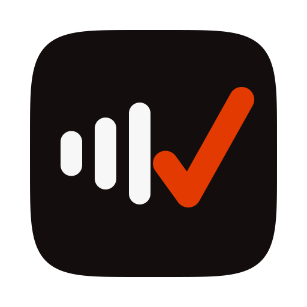

# Minutia Desktop

A native macOS menu bar companion for [Minutia](https://github.com/shiprite-dev/minutia), the open-source Outstanding Issues Log for recurring meetings.

Minutia Desktop records meeting audio directly on your Mac, microphone plus system audio from Zoom, Teams, Meet, or any other app, so meeting notes and action items land in your Minutia instance without a bot joining the call.

## What it does

- **Records mic + system audio.** A CoreAudio process tap captures everything playing on your Mac (macOS 14.4+), mixed with your microphone into a single mono stream.
- **Uploads while the meeting is still running.** Audio is cut into 5-minute m4a segments and uploaded and queued for transcription as soon as each one closes, so the recap starts assembling before you even hang up.
- **Finalizes on stop.** Stopping uploads the full recording, requests the final transcription pass, and opens the flowing recap for that meeting in your browser.
- **Detects meetings automatically.** Watches for a live microphone plus a corroborating signal (Zoom or Teams running, or a calendar event in progress) and surfaces a "Record this meeting?" notification with a one-click Record action.
- **Signs in three ways.** "Sign in with browser" hands off to your Minutia instance and completes via a `minutia://` callback; email/password and Google are available as a fallback.

## Requirements

- macOS 14.4 or later
- Xcode (to build; no signed release yet, see below)
- A running Minutia instance (self-hosted or hosted) to connect to

## Permissions

macOS will prompt for two permissions the first time you record:

- **Microphone**: captures your side of the conversation.
- **Audio Recording** (system audio, via the CoreAudio process tap): captures everything playing on your Mac so the other participants' audio makes it into the transcript.

Neither permission is requested until you actually start a recording.

## Building

This project uses [XcodeGen](https://github.com/yonaskolb/XcodeGen) to generate the Xcode project from `project.yml`, so the `.xcodeproj` is not checked in.

```bash
brew install xcodegen
make test   # generates the project and runs the test suite
make build  # generates the project and builds the app
make run    # builds and opens the app
```

Signed, notarized releases are coming; for now, building from source is the way to run it.

## Configuration

On first launch, Minutia Desktop asks for the Minutia instance URL you want to connect to. It does not assume any particular hosting provider; point it at any Minutia instance, for example `https://minutia.example.com`. The same field is available later in Settings for reconnecting or switching instances, alongside launch-at-login and sign out.

## Privacy

- Raw audio is discarded once the transcript has been safely captured, by default. This is configurable per instance (an admin can switch to keep-forever) in that instance's admin settings, not in this app.
- Nothing is stored outside the Minutia instance you connect to. There is no separate Minutia Desktop backend.
- Recording never starts silently: it is always a Record button press or an explicit notification action.

## License

MIT, see [LICENSE](LICENSE).
